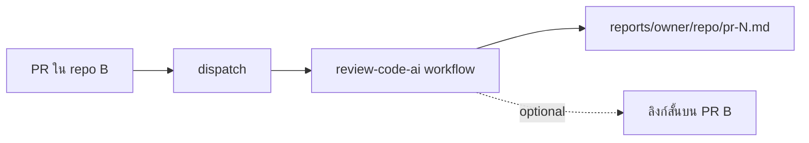

# review-code-ai

AI-powered **GitHub Pull Request** reviews using the [Cursor SDK](https://cursor.com/docs/sdk/typescript). Reviews are saved as **reports in this repo** under `reports/` — not as long comments on the PR (unless you opt in).

## Features

- **Review modes:** `explore` (repo + diff) or `diff` (diff only) — set `REVIEW_MODE`
- **Structured findings** parsed to JSON (`pr-N.json`) with verdict `pass` / `warn` / `fail`
- **Inline PR comments** on GitHub for findings with file + line (`POST_INLINE_COMMENTS`)
- **Local UI** with live log stream (SSE), PR picker, severity filter
- **Chunked review** for large PRs (per-file passes)
- **Incremental review** vs previous report in `reports/`
- Reports stored at `reports/{owner}/{repo}/pr-{n}.md` + `reports/index.json`
- Dashboard: open [`reports/index.html`](reports/index.html) (GitHub Pages or local)
- Review PRs from **other repos** via `repository_dispatch` — reports still land here
- Optional short link comment on the target PR
- Structured review: Summary, Findings (severity), Test plan

## Where to read reports

| Location | How |
|----------|-----|
| **This repo** | Browse [`reports/`](reports/) on GitHub |
| **Dashboard** | `reports/index.html` + `index.json` |
| **Per PR** | `reports/owner/repo/pr-42.md` |

Example after a review:  
`https://github.com/tonsappza/review-code-ai/tree/master/reports`

## Local-first (แนะนำ)

ใช้เครื่องตัวเองเป็นหลัก — ไม่ต้องสร้าง GitHub App

| วิธี | คำสั่ง |
|------|--------|
| **UI** (เลือก PR, log สด) | `npm run ui` → http://127.0.0.1:3847 (หรือ `UI_PORT`) |
| **สคริปต์** | `npm run review:local` (อ่าน `.env`: `TARGET_REPOSITORY`, `PR_NUMBER`) |
| **CLI** | `npm run review` |

ตั้ง `.env` จาก [`.env.example`](.env.example) — `CURSOR_API_KEY` + `gh auth login` (หรือ `GITHUB_TOKEN`) มักพอ

รายละเอียด: [Local development](#local-development-real-pr) ด้านล่าง

## Quick start (this hub repo)

### 1. Secrets

| Secret | Purpose |
|--------|---------|
| `CURSOR_API_KEY` | Cursor API key |
| `REVIEW_GITHUB_TOKEN` | (optional) PAT with `repo` scope to checkout & read PRs in **other** repos |

### 2. PR in this repo

Workflow `.github/workflows/pr-review.yml` runs on PRs here, writes a report, and commits it to `reports/`.

### 3. PRs in other repos (central hub)

In the **target repo**, add a thin workflow that dispatches to this repo:

```yaml
# .github/workflows/trigger-ai-review.yml (in repo ที่ถูก review)
name: Trigger AI review
on:
  pull_request:
    types: [opened, synchronize, reopened]

jobs:
  dispatch:
    runs-on: ubuntu-latest
    steps:
      - uses: peter-evans/repository-dispatch@v3
        with:
          token: ${{ secrets.REVIEW_DISPATCH_TOKEN }}
          repository: tonsappza/review-code-ai
          event-type: review-pr
          client-payload: |
            {
              "owner": "${{ github.repository_owner }}",
              "repo": "${{ github.event.repository.name }}",
              "pr": ${{ github.event.pull_request.number }},
              "ref": "${{ github.event.pull_request.head.sha }}",
              "post_pr_link": true
            }
```

Create `REVIEW_DISPATCH_TOKEN` — a PAT that can trigger workflows on `tonsappza/review-code-ai`.

This repo runs `.github/workflows/review-dispatch.yml`, saves the report under `reports/`, pushes to `master`, and optionally posts a **link only** on the target PR.



## Local development (real PR)

ใช้ PR จริงจาก GitHub API — ไม่ต้องเปิด PR ใน repo นี้

### 1. ตั้ง `.env`

```env
CURSOR_API_KEY=cursor_...
TARGET_REPOSITORY=owner/repo
PR_NUMBER=42
POST_PR_COMMENT=false
POST_PR_LINK=false
```

`GITHUB_TOKEN` ไม่ต้องใส่ถ้ามี `gh auth login` แล้ว (สคริปต์ใช้ `gh auth token` อัตโนมัติ)

### 2. รัน

```powershell
npm run review:local
```

สคริปต์จะ clone branch ของ PR ไปที่ `.review-target/` แล้วรัน Cursor review → บันทึกที่ `reports/owner/repo/pr-N.md`

### 3. ดูผล

- เปิดไฟล์ markdown ใน `reports/`
- หรือ `npx serve reports` แล้วเปิด `index.html`

### Local UI (แนะนำสำหรับทดสอบ)

```powershell
npm run ui
```

เปิดเบราว์เซอร์ที่ **http://127.0.0.1:3847** — กรอก `owner/repo` + เลข PR กด Review ดู log สด และเปิด report ใน panel ขวา (อ่านค่าเริ่มต้นจาก `.env`)

พอร์ตอื่น: `$env:UI_PORT="4000"; npm run ui`

### รันแบบ manual

```bash
npm install
export CURSOR_API_KEY="cursor_..."
export GITHUB_TOKEN="$(gh auth token)"
export GITHUB_REPOSITORY="owner/repo"
export PR_NUMBER="42"
npm run review
```

## Configuration

| Env / input | Default | Meaning |
|-------------|---------|---------|
| `REPORTS_DIR` | `./reports` | Report output directory |
| `POST_PR_COMMENT` | `false` | Post full review on PR |
| `POST_PR_LINK` | `false` | Post link to report on PR |
| `TARGET_REPOSITORY` | `GITHUB_REPOSITORY` | `owner/repo` to review |
| `REVIEW_CWD` | workspace | Path for Cursor agent checkout |
| `KEEP_REVIEW_TARGET` | `false` | เก็บโฟลเดอร์ `.review-target` หลัง review (ค่าเริ่มต้นลบให้) |
| `CHUNK_DIFF_THRESHOLD` | `45000` | ใช้ chunked review เมื่อ diff ใหญ่กว่านี้ |
| `INCREMENTAL_REVIEW` | `false` | เปรียบเทียบกับ report เก่าของ PR เดียวกัน |
| `REPORTS_HUB_REPO` | `tonsappza/review-code-ai` | Used in report URLs |
| `REVIEW_MODE` | `explore` | `diff` or `explore` |

```bash
npm test          # unit tests (parse findings, prompts)
npm run ui        # local UI with PR picker + severity filter
```

## Permissions

**Hub workflows** need `contents: write` to commit reports.

**Dispatch token** needs access to trigger `review-code-ai` and (for `REVIEW_GITHUB_TOKEN`) read target repos.

## GitHub App (optional — ทีหลัง)

เมื่อต้องการให้ **หลาย repo** review อัตโนมัติเมื่อเปิด PR (ไม่จำเป็นถ้าใช้ local / dispatch อยู่แล้ว)

คู่มือ: [docs/GITHUB_APP.md](docs/GITHUB_APP.md) — `npm run webhook` + ngrok

## Security

- Keep `CURSOR_API_KEY` in GitHub Secrets only
- Diff content is sent to Cursor’s API for inference
- Reports are committed to this repo — avoid secrets in PR diffs

## License

MIT
