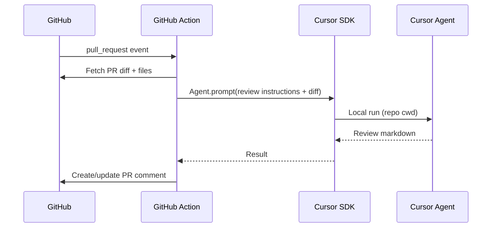

# review-code-ai

AI-powered **GitHub Pull Request** reviews using the [Cursor SDK](https://cursor.com/docs/sdk/typescript). When a PR opens or updates, a GitHub Action fetches the diff, runs a Cursor agent against your repo checkout, and posts (or updates) a single review comment on the PR.

## Features

- Automatic review on `pull_request` (opened, synchronize, reopened)
- Manual re-run via **workflow_dispatch**
- Updates the same bot comment on re-push (no comment spam)
- Truncates very large diffs safely
- Structured review: Summary, Findings (severity), Test plan

## Quick start

### 1. Get a Cursor API key

Create a key at [Cursor Dashboard → Integrations](https://cursor.com/dashboard/integrations).

### 2. Add repository secret

In your GitHub repo: **Settings → Secrets and variables → Actions → New repository secret**

| Name | Value |
|------|--------|
| `CURSOR_API_KEY` | Your `cursor_...` API key |

### 3. Install the workflow

**Option A — use this repo as a GitHub Action** (after you publish it to GitHub):

```yaml
# .github/workflows/ai-pr-review.yml
name: AI PR Review
on:
  pull_request:
    types: [opened, synchronize, reopened]

permissions:
  contents: read
  pull-requests: write
  issues: write

jobs:
  review:
    runs-on: ubuntu-latest
    steps:
      - uses: actions/checkout@v4
        with:
          fetch-depth: 0

      - uses: YOUR_ORG/review-code-ai@v1
        with:
          cursor_api_key: ${{ secrets.CURSOR_API_KEY }}
```

**Option B — copy files into your repo**

Copy `.github/workflows/pr-review.yml` and the project root (`package.json`, `src/`, etc.), then push. The included workflow runs `npm run review` on each PR.

### 4. Open a pull request

The workflow posts a comment titled **AI Code Review** on the PR.

## Local development

```bash
npm install
export CURSOR_API_KEY="cursor_..."
export GITHUB_TOKEN="ghp_..."   # needs repo + pull_requests scope
export GITHUB_REPOSITORY="owner/repo"

# Review PR #42
npx tsx src/review-pr.ts
# Or with explicit PR number (GitHub Actions passes via env in CI)
```

For local runs, set `GITHUB_REPOSITORY` and ensure the workspace is a git checkout of that repo. Use [gh](https://cli.github.com/) to export a token: `export GITHUB_TOKEN=$(gh auth token)`.

## Configuration

| Input / env | Description |
|-------------|-------------|
| `CURSOR_API_KEY` | Required. Cursor API key |
| `GITHUB_TOKEN` | Provided automatically in Actions |
| `REVIEW_MODEL` | Model id (default: `composer-2.5`) |
| `pr_number` | Workflow input for manual runs |

## How it works



## Permissions

The workflow needs:

- `contents: read` — checkout
- `pull-requests: write` — read PR metadata
- `issues: write` — post PR comments

## Security notes

- Store `CURSOR_API_KEY` only in GitHub Secrets, never in the workflow file
- The agent runs in **local** mode against the checked-out repo; diff content is sent to Cursor’s API
- Use a team service account key for org-wide automation if needed

## License

MIT
